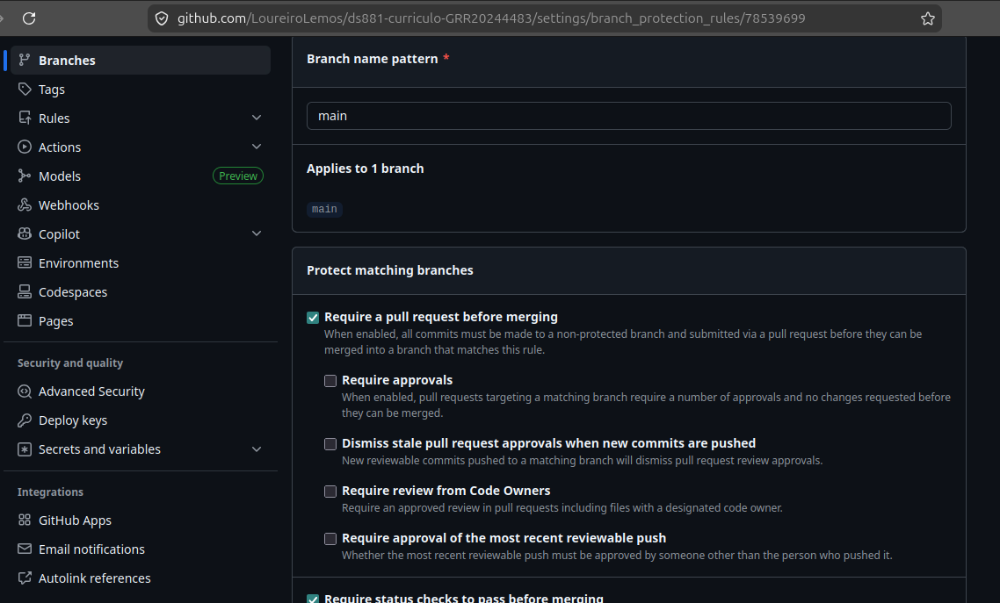
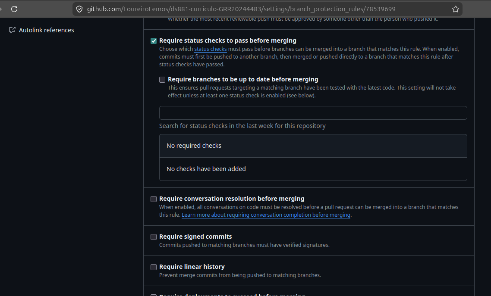
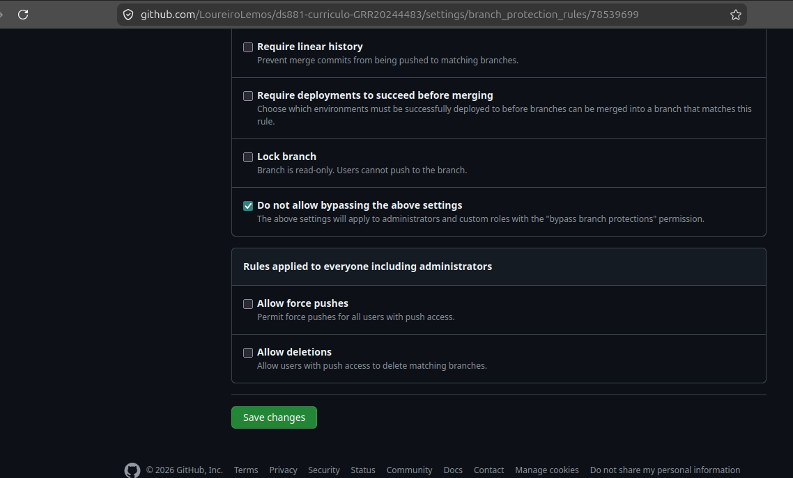

# Currículo

Projeto prático individual da disciplina ds881

## Produção

O deploy automatizado está disponível em : [https://LoureiroLemos.github.io/ds881-curriculo-GRR20244483/]

## Ambiente de Desenvolvimento

A aplicação foi configurada para rodar via contêineres, sem a necessidade de instalar as dependências base no host. O hot reload está habilitado nativamente via bind mount.

Para iniciar o ambiente local:

1. Na raiz do projeto, suba a infraestrutura:
   ```bash
   docker compose up -d --build
   ```
2. Acesse no navegador: `http://localhost:8080/ds881-curriculo-GRR20244483/`
3. Para derrubar os contêineres: `docker compose down`

## Governança e Proteção de Branch

O fluxo de trabalho impede push direto na `main`. A integração de código requer abertura de Pull Request e aprovação nos status checks da pipeline (Linter e Build).




